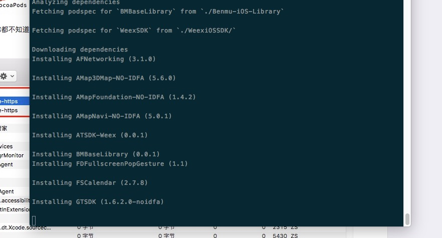
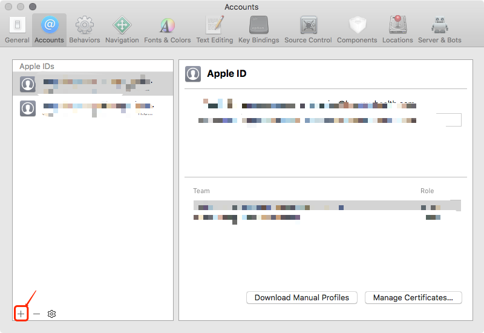
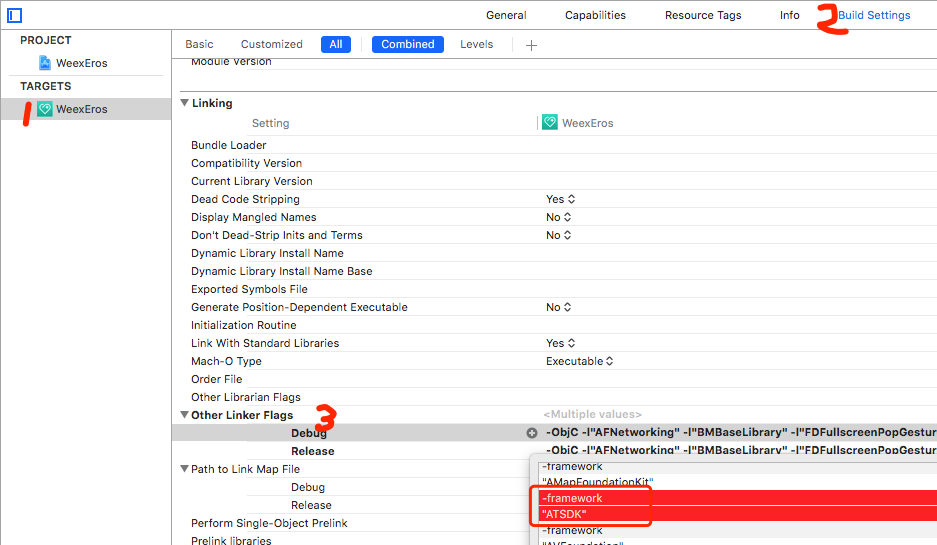

## Q: 手机设置代理后不能上网

A:

1.首先请在查看一次`开发调试`的文档，确认一下是否打开了代理工具（charles、fiddler或其他），如果没有打开请打开相关代理工具；

- Charles 使用教程：http://www.jianshu.com/p/fdd7c681929c
- Fiddler 使用教程：http://www.jianshu.com/p/99b6b4cd273c

## Q: eros dev 开发服务不成功

A:
如果报错
```
...
webpackRun.run is not a function
...
```
请 cd 到您新建的项目中去在尝试

**mac/linux:**
正常来说 mac/linux 下不会有任何报错，如果提示权限不足请 sudo 执行。

**windows**
如果报权限不足，如果 dev.json 未做修改，默认是80端口，请找出80端口占用程序并关闭他。

如果报了以下错误:
> vue packages version mismatch

请全局安装 weex-toolkit，并运行：
```
weex repair
```

## Q: 为什么我当前打出来的 js bundle 会这么大

A:
目前脚手架中正在集成 tree-shaking，因为官方也并未使用 tree-shaking 来优化包体积，所以需要一定时间。

目前可以先这么优化：
```
// 当前：
import {buiButton} from 'Eros/bui'

// 改为：
import buiButton from 'Eros/bui/components/buiButton'
```

这样能明显减少包体积大小。

## Q: 手机设置代理后不能上网

A:

1.首先请在查看一次`开发调试`的文档，确认一下是否打开了代理工具（charles、fiddler或其他），如果没有打开请打开相关代理工具；

- Charles 使用教程：http://www.jianshu.com/p/fdd7c681929c
- Fiddler 使用教程：http://www.jianshu.com/p/99b6b4cd273c


## Q：iOS资源下载慢，或者等待时间巨长（eros install --ios 命令）

A:

执行 `eros install --ios` 命令后会从 git 上加载iOS工程所需要的三方SDK，由于网络原因，或者是墙的原因一些资源加载巨慢，甚至会加载失败如下图：



**解决方法**:从 https://github.com/xiaohuapunk/WeexEros3Rd 仓库将里面的资源文件下载到本地，并拷贝到 (你的工程目录)/platforms/ios/WeexEros 中，然后再次执行`eros install --ios`命令即可；

## Q: IOS模板工程无证书真机调试

A:

> 自 Xcode7 版本之后，苹果爸爸允许开发者无证书真机调试（跟有证书的还是存在一些差异的，很多功能都是用不了的，比如推送），简单几步就可以实现无证书真机调试；

##### 1.注册个人AppleID 账号

- 登录开发者后台（https://developer.apple.com/) 注册一个AppleID，如果之前有账号（就是下载app登录的那个账号）登录进去，同意一下条款即可；

- 在Xcode账号设置中，添加账号



##### 2.无证书真机调试需要先关闭 `Push Notifications` 功能；不然的话就会报下面的错误提示👇

> 我们的模板开启了推送功能，所以需要先将这功能关闭，个人账号是没有这功能的
<br/>


解决办法：

- 修改 Bundle Identifier 注：需要修改成别人没有用到过，苹果会验证唯一性


- 修改team，选择 None（需要先将team设置成none） 


- 找到 Gapabilities，将 `Push Notitications` 关闭


##### 3.在将 Team 设置为自己的账户即可

## 升级工程文件
> 更新前记得将工程备份 <br>
> 有些更新需要更新工程文件，通过 `instal`更新不到，需要使用 `eros update` 命令；<br>

在终端输入 `eros update` 后按提示输入文件的路径即可更新

以下是每个文件路径
- install.sh: `/platforms/ios/WeexEros/install.sh`
- Info：`/platforms/ios/WeexEros/WeexEros/Info.plist`
- Podfile：`/platforms/ios/WeexEros/Podfile`
- AppDelegate.m: `/platforms/ios/WeexEros/WeexEros/AppDelegate.m` <br>
升级完后需要再次执行 `eros install --ios`

## 移除ATSDK
`Weex`默认集成了的 `ATSDK 性能监测工具`，`Eros` 中之前也集成了这个sdk，sdk中用到了私有api，会导致审核不通过，Eros 现在已经将其移除，如果你已经使用`Eros`开发了iOS app 下面是移除方法:

> 2017.12.22 之后初始化的工程不需要此操作

##### 1.升级Podfile文件

- Podfile：`eros update`，path 填写 `/platforms/ios/WeexEros/Podfile`。


##### 2.升级完后需要再次执行 `eros install --ios`
##### 3.修改配置文件

> 在Xcode中：找到Other Linker Flags 并展开，在`Debug`和`Release`中，移除 `ATSDK`的引用，注意：需要将上面的 `-framework`也一同移除



##### 4.重新运行,成功运行起来则说明移除成功了

## Q：errCode->wx_network_error msg->Unable to resolve host 'app.weex-eros.com':No address associated with hostname 

A:
发生这个错误证明您的手机或者模拟器无法连接到您的服务，你需要检查以下情况排查为何无法连接到服务。
1. 确认服务是否开启，可以访问服务如：app.weex-eros.com:8889 （如果端口没有或者不一样需要对应修改）。
2. 如电脑可以正常访问，那么请使用手机浏览器访问继续查看。
3. 如果手机浏览器无法访问，那么您可能需要连接代理。
4. 如果设置代理以后还是无法访问，请确认代理是否设置成功，您可以尝试用手机访问下百度，是否可以访问，并且代理抓包成功。
5. 如果您不想设置代理，可以尝试在手机浏览器里直接用ip（如果有端口记得加上）访问您的服务，如果可以直接访问成功的话。
   您可以将eros-demo/config/eros.native.js 文件里 jsServer 字段改成您的 ip (如果有端口记得加上)。
   然后请重新pack运行 Android程序


## Q：Android 如何修改包名（同一个手机可以跑2个eros 项目）。

A: (本答案由 网友 阿古和刘鹏 贡献~)  
1.修改applicationId（gradle.properties）。  
2.修改签名设置app/build.gradle里面的signingConfigs。  
AS下创建新的签名文件教程：http://blog.csdn.net/donkor_/article/details/53487133 

创建好后，将对应的参数填写到signingConfigs中。  
3.修改app/src/main/AndroidManifest.xml和wxframework\src\main\java\com\benmu\framework\constant\Constant.java  
把两个文件中的com.benmu.weex.example.categoty.page，  
com.benmu.weex.example.categoty.web，  
com.benmu.weex.example.categoty.debug改成一样的，  
比如：com.xuesi.demo.example.categoty.page，  
com.xuesi.demo.example.categoty.web，  
com.xuesi.demo.example.categoty.debug  

## Q：可能您Import Project 之后会发现
```
Failed to resolve: com.android.support:appcompat-v7:25.3.1 
Add Google Maven repository and sync project 
Show in File
Show in Project Structure dialog 
```
A： 这时候您可以直接点击 Add Google Maven repository and sync project 等待编译完成即可
